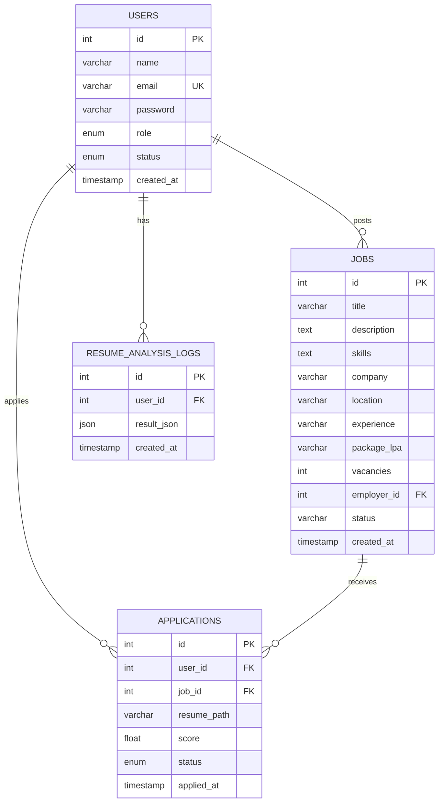
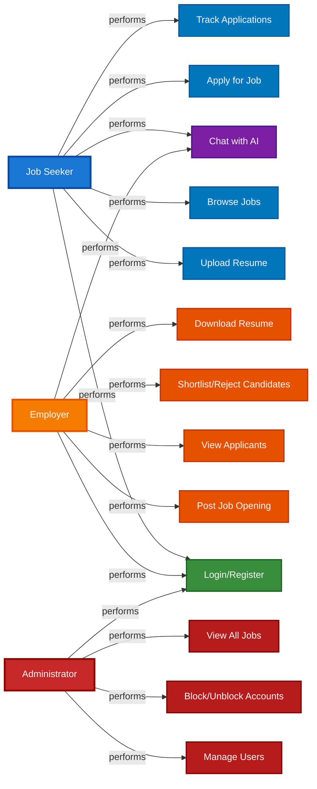
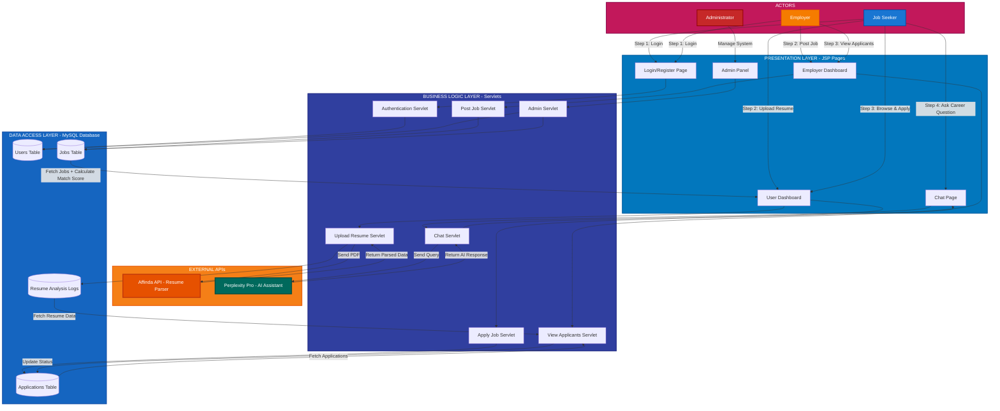
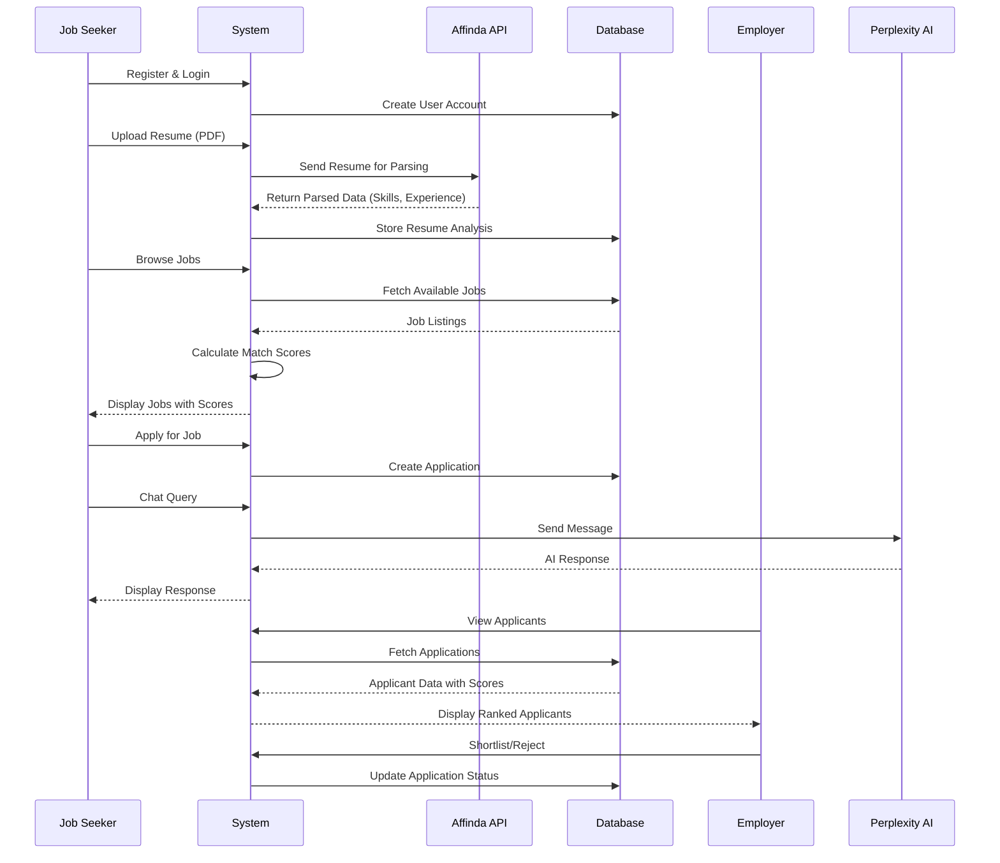

# Elevare - Smart Recruitment Platform

<div align="center">


**AI-Powered Recruitment Made Simple**

[](https://www.oracle.com/java/)
[](https://hibernate.org/)
[](https://www.mysql.com/)
[](https://getbootstrap.com/)


[Features](#-features) • [Tech Stack](#-tech-stack) • [Installation](#-installation) • [Usage](#-usage-guide) • [API Integration](#-api-integration) • [Screenshots](#-screenshots)

</div>

---

## Table of Contents

- [About](#-about)
- [Features](#-features)
- [Tech Stack](#-tech-stack)
- [Architecture](#-architecture)
- [Prerequisites](#-prerequisites)
- [Installation](#-installation)
- [Configuration](#%EF%B8%8F-configuration)
- [Database Setup](#-database-setup)
- [Running the Application](#-running-the-application)
- [Usage Guide](#-usage-guide)
- [API Integration](#-api-integration)
- [Project Structure](#-project-structure)
- [Screenshots](#-screenshots)
- [Contributing](#-contributing)
- [Contact](#-contact)

---

## About

**Elevare** is an intelligent recruitment platform that revolutionizes the hiring process through AI-powered resume analysis and smart candidate matching. The platform connects job seekers with employers while automating tedious recruitment tasks through advanced resume parsing and skill matching algorithms.

### Key Highlights

- **AI-Powered Matching**: Automatic resume analysis using Affinda API
- **Smart Scoring**: Real-time candidate-job compatibility scoring
- **AI Chat Assistant**: Integrated Perplexity Pro chatbot for instant career guidance
- **Multi-Role System**: Separate dashboards for Users, Employers, and Admins
- **Email Integration**: OTP verification and notification system
- **Modern UI**: Responsive glassmorphism design with smooth animations
- **Secure**: Session-based authentication with role management

---

## Features

### For Job Seekers (Users)

- **Profile Creation**: Register and create professional profiles
- **Resume Upload**: Upload PDF resumes for automatic parsing
- **Smart Job Search**: Search and filter jobs by location, experience, package, etc.
- **Match Score**: See your compatibility percentage with each job
- **Application Tracking**: Track application status (Applied/Shortlisted/Rejected)
- **Personalized Recommendations**: AI-based job matching
- **AI Chat Assistant**: Get instant help with career advice, resume tips, and job search queries through an intelligent chatbot powered by Perplexity Pro AI

### For Employers

- **Job Posting**: Create detailed job listings with required skills
- **View Applicants**: See all candidates who applied for your jobs
- **Filter Applicants**: Filter by application status
- **Resume Scoring**: Automatic candidate-job match percentage
- **Resume Download**: Download candidate resumes
- **Application Management**: Shortlist or reject candidates
- **Dashboard Analytics**: Track posted jobs and applicant metrics

### For Administrators

- **User Management**: View and manage all users (employers & job seekers)
- **Account Control**: Block/unblock user accounts
- **Search & Filter**: Search users by name, email, or role
- **System Overview**: Monitor platform activity

### System Features

- **Authentication**: Email-based registration with OTP verification
- **Session Management**: Secure session handling with role-based access
- **Email Notifications**: Automated email for OTP and notifications
- **AI Chat Assistant**: Integrated Perplexity Pro AI-powered chatbot for career guidance and support
- **Responsive Design**: Mobile-first, fully responsive UI
- **Modern UI/UX**: Glassmorphism design with gradient backgrounds
- **Fast Performance**: Hibernate ORM for optimized database operations

---

## Tech Stack

### Backend

| Technology | Version | Purpose |
|------------|---------|---------|
| **Java** | 17 | Core programming language |
| **Jakarta EE** | 11.0.0-M4 | Enterprise Java specifications |
| **Hibernate ORM** | 7.0.8 | Object-relational mapping |
| **MySQL** | 8.0.33 | Relational database |
| **Maven** | 3.x | Dependency management & build tool |
| **JavaMail** | 1.6.2 | Email functionality |

### Frontend

| Technology | Version | Purpose |
|------------|---------|---------|
| **JSP** | 3.1 | Server-side templating |
| **Bootstrap** | 5.3.8 | CSS framework |
| **Bootstrap Icons** | 1.10.5 | Icon library |
| **Font Awesome** | 6.0.0 | Additional icons |
| **SweetAlert2** | 11.x | Beautiful alerts |
| **JavaScript** | ES6+ | Client-side scripting |

### External APIs

| API | Purpose |
|-----|---------|
| **Affinda API** | Resume parsing and skill extraction |
| **Perplexity Pro AI** | AI-powered chat assistant for career guidance |

### Development Tools

- **IntelliJ IDEA** - IDE
- **Apache Tomcat** - Application server
- **Git** - Version control
- **MySQL Workbench** - Database management

---

## Architecture

### Three-Tier Architecture

```
┌─────────────────────────────────────┐
│     Presentation Layer              │
│ (JSP, CSS, JavaScript, Bootstrap)   │
└──────────────┬──────────────────────┘
               │
               ▼
┌─────────────────────────────────────┐
│     Business Logic Layer            │
│  (Servlets, Services, DAOs)         │
└──────────────┬──────────────────────┘
               │
               ▼
┌─────────────────────────────────────┐
│     Data Access Layer               │
│   (Hibernate ORM, MySQL)            │
└─────────────────────────────────────┘
```

### Package Structure

```
in.hiresense
├── controllers/         # Servlet controllers
├── services/           # Business logic layer
├── dao/                # Data access objects
├── pojo/               # Entity classes (POJOs)
├── utils/              # Utility classes
└── dbutils/            # Database configuration
```

### Database Schema (ER Diagram)



### Use Case Diagram



### Data Flow Diagram



### System Workflow



---

## Prerequisites

Before you begin, ensure you have the following installed:

- **Java Development Kit (JDK)** 17 or higher
- **Apache Maven** 3.6 or higher
- **MySQL Server** 8.0 or higher
- **Apache Tomcat** 10.x or higher
- **Git** (for cloning the repository)
- **IntelliJ IDEA** (recommended) or any Java IDE

### System Requirements

- **OS**: Windows 10/11, macOS, or Linux
- **RAM**: Minimum 4GB (8GB recommended)
- **Disk Space**: At least 500MB free space

---

## Installation

### Step 1: Clone the Repository

```bash
git clone https://github.com/yourusername/elevare.git
cd elevare
```

### Step 2: Install Dependencies

```bash
mvn clean install
```

This will download all required dependencies specified in `pom.xml`.

---

## Configuration

### 1. Database Configuration

Edit `src/main/resources/hibernate.cfg.xml`:

```xml
<hibernate-configuration xmlns="http://www.hibernate.org/xsd/orm/cfg">
    <session-factory>
        <property name="hibernate.connection.driver_class">com.mysql.cj.jdbc.Driver</property>
        <property name="hibernate.connection.url">jdbc:mysql://localhost:3306/hiresense_hibernate</property>
        <property name="hibernate.connection.username">YOUR_MYSQL_USERNAME</property>
        <property name="hibernate.connection.password">YOUR_MYSQL_PASSWORD</property>
        <property name="hibernate.show_sql">true</property>
    </session-factory>
</hibernate-configuration>
```

### 2. Email Configuration

Create/Edit `src/main/resources/config.properties`:

```properties
# Email Configuration
mail.smtp.host=smtp.gmail.com
mail.smtp.port=587
mail.smtp.auth=true
mail.smtp.starttls.enable=true
mail.username=your-email@gmail.com
mail.password=your-app-password

# Affinda API Configuration
api.key=YOUR_AFFINDA_API_KEY

# Perplexity AI Configuration
chat.api=YOUR_PERPLEXITY_API_KEY
```

**Note**: For Gmail, use [App Password](https://support.google.com/accounts/answer/185833) instead of your regular password.
**Note**: Get your Perplexity API key from [Perplexity AI Settings](https://www.perplexity.ai/settings/api).

### 3. Application Configuration

Edit `src/main/webapp/WEB-INF/web.xml` if needed:

```xml
<context-param>
    <param-name>appName</param-name>
    <param-value>Elevare</param-value>
</context-param>
```

---

## Database Setup

### Step 1: Create Database

```sql
CREATE DATABASE hiresense_hibernate CHARACTER SET utf8mb4 COLLATE utf8mb4_unicode_ci;
USE hiresense_hibernate;
```

### Step 2: Create Tables

#### Users Table

```sql
CREATE TABLE users (
    id INT PRIMARY KEY AUTO_INCREMENT,
    name VARCHAR(100) NOT NULL,
    email VARCHAR(100) NOT NULL UNIQUE,
    password VARCHAR(255) NOT NULL,
    role ENUM('user', 'employer', 'admin') NOT NULL DEFAULT 'user',
    status ENUM('active', 'blocked') DEFAULT 'active',
    created_at TIMESTAMP DEFAULT CURRENT_TIMESTAMP
);
```

#### Jobs Table

```sql
CREATE TABLE jobs (
    id INT PRIMARY KEY AUTO_INCREMENT,
    title VARCHAR(150) NOT NULL,
    description TEXT NOT NULL,
    skills TEXT NOT NULL,
    company VARCHAR(100) NOT NULL,
    location VARCHAR(100),
    experience VARCHAR(50),
    package_lpa VARCHAR(50),
    vacancies INT,
    employer_id INT,
    created_at TIMESTAMP DEFAULT CURRENT_TIMESTAMP,
    status VARCHAR(10) NOT NULL DEFAULT 'active',
    FOREIGN KEY (employer_id) REFERENCES users(id)
);
```

#### Applications Table

```sql
CREATE TABLE applications (
    id INT PRIMARY KEY AUTO_INCREMENT,
    user_id INT NOT NULL,
    job_id INT NOT NULL,
    resume_path VARCHAR(255),
    score FLOAT,
    status ENUM('applied', 'shortlisted', 'rejected') DEFAULT 'applied',
    applied_at TIMESTAMP DEFAULT CURRENT_TIMESTAMP,
    FOREIGN KEY (user_id) REFERENCES users(id),
    FOREIGN KEY (job_id) REFERENCES jobs(id)
);
```

#### Resume Analysis Logs Table

```sql
CREATE TABLE resume_analysis_logs (
    id INT PRIMARY KEY AUTO_INCREMENT,
    user_id INT NOT NULL,
    result_json JSON NOT NULL,
    created_at TIMESTAMP DEFAULT CURRENT_TIMESTAMP,
    FOREIGN KEY (user_id) REFERENCES users(id)
);
```

### Step 3: Insert Default Admin

```sql
INSERT INTO users (name, email, password, role, is_verified, status)
VALUES ('Admin', 'admin@elevare.com', 'admin123', 'admin', TRUE, 'active');
```

---

## Running the Application

### Method 1: Using IDE (IntelliJ IDEA)

1. **Import Project**: Open IntelliJ IDEA → File → Open → Select project folder
2. **Configure Tomcat**:
    - Run → Edit Configurations → Add New Configuration → Tomcat Server → Local
    - Click "Fix" button → Add `HireSenseHibernate:war exploded`
    - Set Application Context: `/`
3. **Run**: Click the green Run button

### Method 2: Using Maven

```bash
# Build the WAR file
mvn clean package

# Deploy to Tomcat
cp target/HireSenseHibernate-1.0-SNAPSHOT.war $TOMCAT_HOME/webapps/

# Start Tomcat
$TOMCAT_HOME/bin/catalina.sh run  # Linux/Mac
$TOMCAT_HOME\bin\catalina.bat run  # Windows
```

### Method 3: Using Maven Tomcat Plugin

Add to `pom.xml`:

```xml
<plugin>
    <groupId>org.apache.tomcat.maven</groupId>
    <artifactId>tomcat7-maven-plugin</artifactId>
    <version>2.2</version>
    <configuration>
        <port>8080</port>
        <path>/</path>
    </configuration>
</plugin>
```

Run:

```bash
mvn tomcat7:run
```

### Access the Application

Open your browser and navigate to:

```
http://localhost:8080/
```

---

## Usage Guide

### For Job Seekers

1. **Register**: Navigate to Register page → Enter details → Verify OTP
2. **Login**: Use credentials to login
3. **Upload Resume**: From dashboard, upload your PDF resume (first time only)
4. **Browse Jobs**: View available jobs with match percentages
5. **Apply**: Click "Apply Now" on desired jobs
6. **Track**: Monitor application status
7. **AI Chat**: Click on the chat icon to get instant career advice, resume tips, and job search assistance

### For Employers

1. **Register**: Select "Employer" role during registration
2. **Post Jobs**: Navigate to "Post a Job" → Fill details → Submit
3. **View Jobs**: See all your posted jobs
4. **Manage Applicants**: Click "View Applicants" → Shortlist/Reject candidates
5. **Download Resumes**: Download candidate resumes for review

### For Admins

1. **Login**: Use admin credentials
2. **View Users**: Access admin panel to see all users
3. **Search**: Search by name, email, or filter by role
4. **Block/Unblock**: Manage user access

---

## API Integration

### Affinda Resume Parser API

Elevare uses [Affinda API](https://www.affinda.com/) for intelligent resume parsing.

#### Setup

1. Sign up at [Affinda](https://www.affinda.com/)
2. Get your API key from dashboard
3. Add to `config.properties`:

```properties
api.key=YOUR_AFFINDA_API_KEY
```

#### Features Used

- Resume text extraction
- Skills identification
- Education parsing
- Work experience extraction
- Contact information extraction

#### API Endpoints Used

```
POST https://api.affinda.com/v2/resumes
```

#### Example Response

```json
{
  "data": {
    "name": "John Doe",
    "email": "john@example.com",
    "skills": ["Java", "Python", "SQL"],
    "education": {...},
    "experience": {...}
  }
}
```

---

### Perplexity Pro AI Chat Assistant

Elevare integrates [Perplexity AI](https://www.perplexity.ai/) to provide an intelligent chat assistant for job seekers.

#### Setup

1. Visit [Perplexity AI Settings](https://www.perplexity.ai/settings/api)
2. Sign in with your Perplexity account
3. Generate an API key (requires Pro subscription)
4. Add to `config.properties`:

```properties
chat.api=YOUR_PERPLEXITY_API_KEY
```

#### Model Used

- **sonar-pro**: Perplexity's most advanced reasoning model with real-time web access

#### Features

- **Career Guidance**: Get personalized career advice and job search strategies
- **Resume Tips**: Receive suggestions to improve your resume
- **Interview Preparation**: Ask questions about interview tips and techniques
- **Job Market Insights**: Real-time industry trends and requirements from the web
- **Skill Development**: Get recommendations for skills to learn
- **Web-Enhanced Responses**: Answers enriched with current web information
- **Contextual Conversations**: Maintains chat history for context-aware responses

#### API Endpoint Used

```
POST https://api.perplexity.ai/chat/completions
```

#### Chat Interface Features

- Modern chat UI with message bubbles
- Markdown support for formatted responses
- Code syntax highlighting
- Auto-scroll to latest messages
- Error handling with user-friendly messages
- Session-based chat history
- Real-time web-enhanced AI responses

---

## Project Structure

```
elevare/
├── src/
│   ├── main/
│   │   ├── java/
│   │   │   └── in/
│   │   │       └── hiresense/
│   │   │           ├── controllers/
│   │   │           │   ├── LoginServlet.java
│   │   │           │   ├── RegistrationServlet.java
│   │   │           │   ├── OTPVerificationServlet.java
│   │   │           │   ├── UserDashboardServlet.java
│   │   │           │   ├── EmployerDashboardServlet.java
│   │   │           │   ├── PostJobServlet.java
│   │   │           │   ├── ApplyJobServlet.java
│   │   │           │   ├── UploadResumeServlet.java
│   │   │           │   ├── ViewApplicantsServlet.java
│   │   │           │   ├── UpdateApplicationStatusServlet.java
│   │   │           │   ├── DownloadResumeServlet.java
│   │   │           │   ├── AdminPanelServlet.java
│   │   │           │   ├── UpdateUserStatusServlet.java
│   │   │           │   ├── ToggleJobStatusServlet.java
│   │   │           │   ├── ChatServlet.java
│   │   │           │   ├── LogoutServlet.java
│   │   │           │   └── ViewFullDetailsServlet.java
│   │   │           ├── services/
│   │   │           │   ├── UserService.java
│   │   │           │   ├── JobServices.java
│   │   │           │   ├── ApplicationService.java
│   │   │           │   └── ResumeAnalysisLogService.java
│   │   │           ├── dao/
│   │   │           │   ├── UserDao.java
│   │   │           │   ├── JobDao.java
│   │   │           │   ├── ApplicationDao.java
│   │   │           │   └── ResumeAnalysisLogDao.java
│   │   │           ├── pojo/
│   │   │           │   ├── UserPojo.java
│   │   │           │   ├── JobPojo.java
│   │   │           │   ├── ApplicationPojo.java
│   │   │           │   └── ResumeAnalysisLogsPojo.java
│   │   │           ├── utils/
│   │   │           │   ├── AffindaAPI.java
│   │   │           │   ├── AIResponseFormatter.java
│   │   │           │   ├── MailUtil.java
│   │   │           │   ├── MailConfig.java
│   │   │           │   ├── MyAuthenticator.java
│   │   │           │   └── AppConfig.java
│   │   │           └── dbutils/
│   │   │               ├── DBConnection.java
│   │   │               └── AppInitializer.java
│   │   ├── resources/
│   │   │   ├── hibernate.cfg.xml
│   │   │   └── config.properties
│   │   └── webapp/
│   │       ├── WEB-INF/
│   │       │   └── web.xml
│   │       ├── css/
│   │       │   └── styles.css
│   │       ├── includes/
│   │       │   ├── header.jsp
│   │       │   └── footer.jsp
│   │       ├── index.jsp
│   │       ├── login.jsp
│   │       ├── register.jsp
│   │       ├── userDashboard.jsp
│   │       ├── employerDashboard.jsp
│   │       ├── viewApplicants.jsp
│   │       ├── viewFullDetails.jsp
│   │       ├── chat.jsp
│   │       └── adminPanel.jsp
│   └── test/
│       └── java/
├── target/
├── .gitignore
├── pom.xml
├── README.md
└── LICENSE
```

---

## Screenshots

### Home Page

*Landing page with hero section and features*

### Registration Page

*Registration page with otp verification*

### Login Page

*Login page with session tracking*

### User Dashboard

*Job listings with smart filtering and match scores*

### Employer Dashboard


*Job posting and management interface*

### View Applicants

*Applicant management with scoring*

### View Applicant's Full Details


*Full Details of applicant including personal details, skills, work experience, summary & education*

### AI Chat Assistant

*Perplexity Pro AI-powered chat assistant for career guidance with real-time web access*

### Admin Panel


*User management interface*

---

## Contributing

Contributions are welcome! Please follow these steps:

1. Fork the repository
2. Create your feature branch: `git checkout -b feature/AmazingFeature`
3. Commit your changes: `git commit -m 'Add some AmazingFeature'`
4. Push to the branch: `git push origin feature/AmazingFeature`
5. Open a Pull Request

### Coding Standards

- Follow Java naming conventions
- Add comments for complex logic
- Write meaningful commit messages
- Test before submitting PR

---

## Contact

**Project Maintainer**: Neeraj Wadhwaney

- Email: neerajwadhwaney2003@gmail.com
- GitHub: [@neeraj2710](https://github.com/neeraj2710)
- LinkedIn: [www.linkedin.com/in/neeraj-w](https://linkedin.com/in/neeraj-w)

**Project Link**: [https://github.com/neeraj2710/Elevare_Hibernate](https://github.com/neeraj2710/Elevare_Hibernate)

---

## Acknowledgments

- [Affinda](https://www.affinda.com/) - Resume parsing API
- [Perplexity AI](https://www.perplexity.ai/) - AI chat assistant with real-time web access
- [Bootstrap](https://getbootstrap.com/) - Frontend framework
- [Hibernate](https://hibernate.org/) - ORM framework
- [Font Awesome](https://fontawesome.com/) - Icons
- [SweetAlert2](https://sweetalert2.github.io/) - Beautiful alerts
- [Marked.js](https://marked.js.org/) - Markdown parser
- [Highlight.js](https://highlightjs.org/) - Code syntax highlighting

---

## Project Stats


---

<div align="center">

**Made by the Neeraj Wadhwaney**

Star this repository if you find it helpful!

</div>